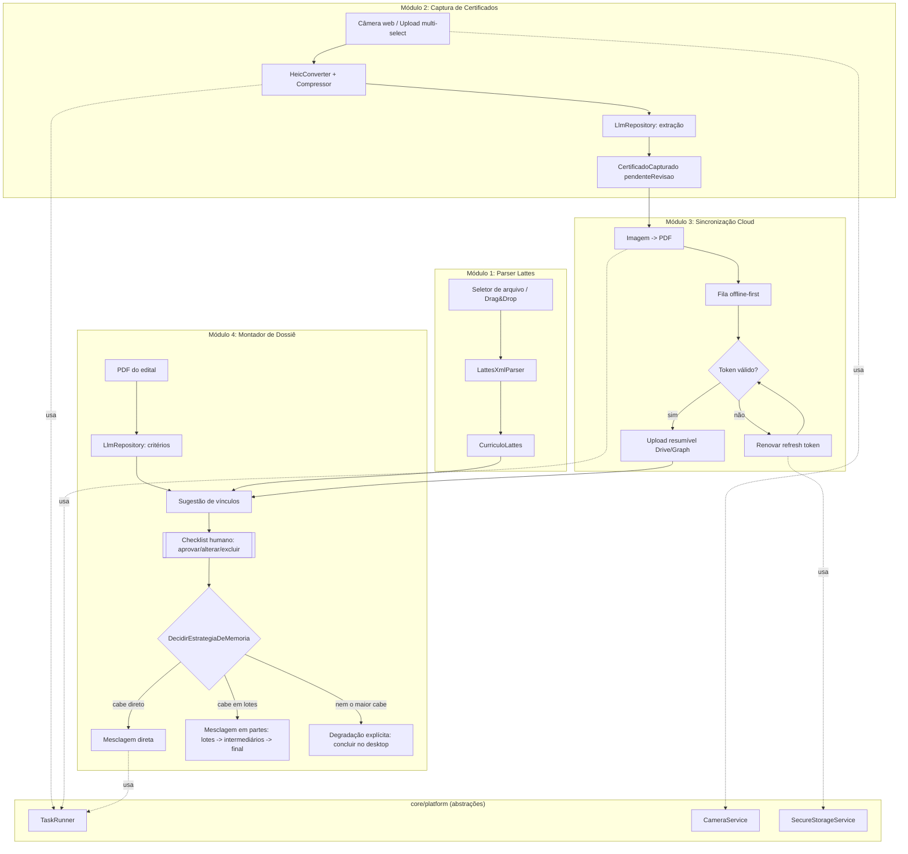

# Arquitetura — Certificados Lattes

Fase 1: Flutter Web (PWA), instalável em desktop e mobile. Fase 2: apps nativos Android/iOS
reaproveitando domínio e casos de uso sem reescrita. Este documento descreve a fundação criada
para sustentar essa transição.

## 1. Princípios

1. **Feature-first + Clean Architecture.** Cada módulo de negócio é uma feature isolada com três
   camadas (`domain`, `data`, `presentation`). Dependências apontam sempre para dentro: `presentation`
   depende de `domain`, `data` implementa `domain`, e `domain` não depende de nada externo.
2. **Domínio 100% agnóstico de plataforma.** Nenhuma entidade, repositório ou use case importa
   `dart:html`, `package:web`, `camera`, ou qualquer API específica de navegador ou SO.
3. **Tudo que é específico de plataforma vive atrás de uma interface em `core/platform`.** A troca
   Web → Nativo na fase 2 é troca de implementação (uma classe nova), nunca reescrita de use case.
4. **Sem backend próprio.** O "backend" de arquivos é o Google Drive/OneDrive do usuário; o
   "backend" de inteligência é a API de LLM chamada diretamente do cliente (BYOK, ver RISCOS.md).
5. **Multiusuário desde a concepção, sem storage compartilhado.** Qualquer pessoa loga com a
   própria conta Google/Microsoft (ver `AuthRepository`); cada sessão de navegador autentica e
   opera isoladamente sobre a nuvem da própria pessoa. Não existe conceito de "usuário dono do
   app" nem arquivo visível entre contas diferentes — confirmado explicitamente pelo usuário em
   2026-09-12 (já era o design original; ver DECISOES.md e RISCOS.md item 10 para as
   implicações de operar isso em produção).

## 2. Camadas

- **domain/**: entidades (`Equatable`, imutáveis), interfaces de repositório (contratos, sem
  implementação) e use cases (uma classe por ação de negócio, com um método `call`). É a única
  camada com 100% de cobertura de teste exigida e a única que pode ser copiada sem alteração para
  o app nativo da fase 2.
- **data/**: implementações concretas dos repositórios, datasources (XML, HTTP, câmera via
  `core/platform`, storage local) e mapeamento entre modelos externos (XML, JSON de API) e
  entidades de domínio. É aqui que exceções de infraestrutura são capturadas e traduzidas em
  `Failure`s de domínio (ver `core/error/failures.dart`).
- **presentation/**: providers Riverpod (`AsyncNotifier`/`StateNotifier`), páginas e widgets.
  Não contém regra de negócio; apenas orquestra chamadas a use cases e exibe estado.

## 3. Estrutura de diretórios (resumo — árvore completa no item 3 dos entregáveis)

```
lib/
  core/
    di/                 -> injeção de dependência (Riverpod ProviderScope + overrides)
    routing/             -> go_router, rotas nomeadas, restauração de fluxo pós-reload
    platform/             -> abstrações de plataforma (task_runner, camera, secure_storage)
    error/                -> Failure e exceções de domínio
    utils/                -> constantes, breakpoints responsivos
  features/
    lattes_parser/        -> Módulo 1
    certificate_capture/  -> Módulo 2
    cloud_sync/           -> Módulo 3
    dossie_builder/        -> Módulo 4
    llm_shared/            -> cliente LLM compartilhado (BYOK) entre módulos 2 e 4
web/
  index.html, manifest.json, sw.js
test/
  features/..., fixtures/...
```

## 4. Fluxo de dados dos 4 módulos

### 4.1 Parser Lattes (100% local, sem IA) — único módulo funcional de ponta a ponta

```
Usuário toca "Selecionar XML do Lattes" (LattesImportPage)
  -> LattesFileDatasourceWeb (file_picker; withData: true; fallback UTF-8 -> Latin-1)
  -> LattesXmlParser.parse(String xmlContent)   [core: dart:xml, síncrono]
  -> LattesRepositoryImpl mapeia XmlDocument -> CurriculoLattes (entidade), nunca lança
  -> ImportarCurriculoLattes (use case) retorna Either<Failure, CurriculoLattes>
  -> LattesImportController (Riverpod Notifier, lattes_providers.dart) expõe LattesImportState
  -> CurriculoListView renderiza dados gerais, cursos, experiências, publicações, orientações
     e produção técnica; vínculos com precisaConfirmacaoVinculoAtual mostram botões Sim/Não
  -> Resposta do usuário -> ConfirmarVinculoAtual (use case) -> novo CurriculoLattes no estado
```

Este é o único fluxo com TODAS as camadas implementadas (não apenas domínio + stub) nesta
entrega — os módulos 2 a 4 abaixo continuam com `data/` em stub documentado.

### 4.2 Captura de certificados

```
[Mobile: getUserMedia + guia de enquadramento]   [Desktop: file_picker multi-select / drag&drop]
  -> CameraCaptureDatasource / UploadDropzoneDatasource
  -> HeicConverter (se necessário) roda em TaskRunner (chunked no web / Isolate nativo)
  -> ImageCompressor (package:image) reduz resolução antes do envio ao LLM
  -> ExtrairDadosCertificadoLlm (use case) chama LlmRepository (BYOK)
  -> LLM retorna JSON: {titulo, instituicao, cargaHoraria, data, vinculoSugerido}
  -> CertificadoCapturado (entidade) criado com status = pendenteRevisao
  -> Estado persistido via UploadQueueLocalStore (Hive/IndexedDB) para sobreviver a reload
```

### 4.3 Sincronização Cloud

```
CertificadoCapturado aprovado (ou aguardando) na fila
  -> Converter imagem em PDF (TaskRunner: pdf + image, chunked/isolate)
  -> Renomear em padrão determinístico: {AAAA-MM-DD}_{categoria}_{hashCurto}.pdf
  -> EnviarPdfParaCloud (use case) -> CloudStorageRepository (Google Drive API ou MS Graph)
  -> Upload resumível (sessão de upload da própria API); falha de rede -> volta para fila
     offline-first com retry exponencial (package:retry)
  -> AuthRepository garante token válido (renovação automática de refresh token antes de cada
     chamada; token nunca é lido diretamente pelos use cases, só via interceptor do Dio)
```

### 4.4 Montador de Dossiê (human-in-the-loop obrigatório)

```
Usuário fornece PDF do edital
  -> ExtrairCriteriosEdital (use case) -> LlmRepository interpreta critérios de pontuação
     da Prova de Títulos -> List<CriterioPontuacao>
  -> SugerirVinculos (use case) cruza critérios com CertificadosCapturados já sincronizados
     -> List<VinculoSugerido> (nunca aprovado automaticamente)
  -> DossieChecklistPage: usuário aprova / altera / exclui cada vínculo
     -> estado DossieEmMontagem persistido a cada interação (retomável pós-reload)
  -> Usuário confirma -> CompilarDossie (use case) -> DecidirEstrategiaDeMemoria escolhe entre:
     (a) mesclagem DIRETA (cabe tudo de uma vez no teto de TaskRunner.estimatedSafeHeapBytes:
         350MB fixo no iOS, dinâmico via navigator.deviceMemory no Android);
     (b) mesclagem EM PARTES (lotes sequenciais -> PDFs intermediários -> mesclagem final),
         com Dossie.loteAtual/totalDeLotes atualizados a cada lote para a UI mostrar progresso;
     (c) DegradacaoExplicita (só quando nem o maior certificado isolado cabe no dispositivo):
         interrompe ANTES de travar e orienta o usuário a concluir no desktop
```

## 5. Diagrama (Mermaid)



## 6. Abstrações de plataforma

Vivem em `lib/core/platform/*`. Cada uma define uma interface abstrata (`domain` da própria
abstração, sem qualquer import de UI) e duas implementações: `_web.dart` (ativa hoje) e
`_native.dart` (esqueleto documentado para a fase 2, com corpo `throw UnimplementedError('fase 2')`
e comentário explicando o que vai entrar ali). A seleção de implementação acontece em
`core/di/injection.dart` via `kIsWeb`.

| Abstração | Interface | Implementação Web (fase 1) | O que muda na fase 2 (nativo) |
|---|---|---|---|
| `TaskRunner` | roda função pesada fora da UI thread; expõe `estimatedSafeHeapBytes` (350MB fixo no iOS, dinâmico via `navigator.deviceMemory` no Android, fixo no desktop) | Processamento em chunks com `Future.delayed(Duration.zero)`/`Timer` para ceder o event loop (dart:isolate não existe no Web); tarefas realmente pesadas (merge de PDF grande) usam Web Worker via `package:web` + `dart:js_interop` | `dart:isolate` (`Isolate.run`); teto de memória lido do dispositivo real (ex. `device_info_plus`) em vez de `navigator.deviceMemory` |
| `CameraService` | captura de foto ao vivo | `getUserMedia` + `<video>`/`<canvas>` via `package:web` | plugin `camera` nativo (Isolate para pós-processamento) |
| `SecureStorageService` | guarda tokens OAuth e chave LLM | Web Crypto API (AES-GCM), chave não exportável em IndexedDB | `flutter_secure_storage` (Keychain/Keystore) |
| `HeicConverter` | HEIC -> JPEG | ``/`<canvas>` (Safari decodifica HEIC nativamente); fallback pede export manual | `heic_to_jpg` (biblioteca nativa) |
| `ConnectivityGate` | detecta perda/retorno de rede | `connectivity_plus` + erro de rede do Dio como sinal redundante | `connectivity_plus` nativo (eventos mais granulares) |

Detalhe de teto de tamanho (memória) documentado por abstração em `RISCOS.md`, seção
"Memória no Safari iOS", com valores separados para desktop e Safari iOS.

## 7. Estratégia responsiva

Breakpoints (definidos em `lib/core/utils/breakpoints.dart`):

| Nome | Largura | Uso |
|---|---|---|
| `compact` | 360–599px | celular retrato; navegação em bottom bar; checklist de vínculo em lista de cards full-width; alvo de toque mínimo 48x48dp |
| `medium` | 600–1023px | tablet retrato / celular paisagem; navegação em rail lateral colapsado; duas colunas no checklist |
| `expanded` | 1024–1919px | desktop/tablet paisagem; navegação em rail expandido; três colunas; drag&drop de múltiplos arquivos habilitado |
| `large` | ≥1920px | desktop grande; conteúdo centralizado com largura máxima de 1600px para não esticar linhas de texto |

Regras fixas: nenhum layout é "desktop encolhido" — cada breakpoint tem uma composição de widgets
própria (`LayoutBuilder` + `ResponsiveScaffold` em `core/utils`), não apenas reflow do mesmo
`Row`/`Column`. Componentes de decisão crítica (aprovar vínculo, confirmar compilação do dossiê)
usam alvos de toque ≥48dp mesmo em `expanded`/`large`, para consistência entre mouse e dedo.

## 8. O que fica fixo entre Fase 1 e Fase 2

`domain/**` de todas as features, `core/error`, e as assinaturas dos use cases não mudam. O que
muda está inteiramente documentado em `ROADMAP_MOBILE.md`.
